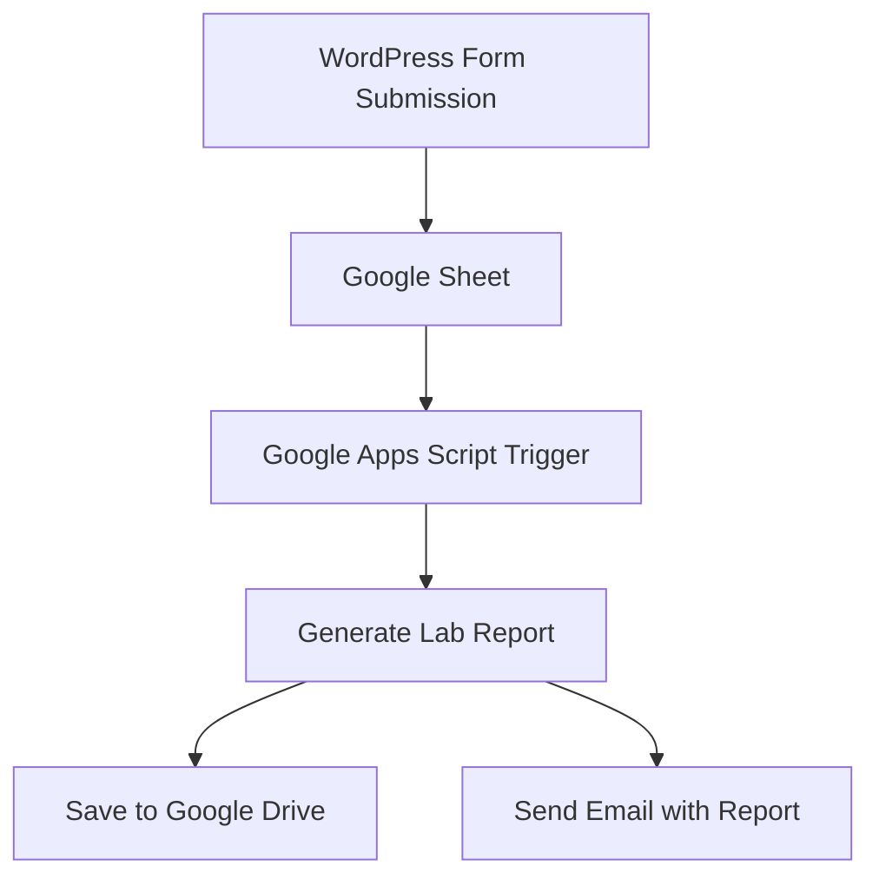
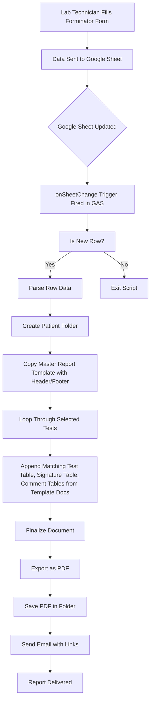

# Google Apps Script: Lab Report Automation

> [!NOTE]
> This lab report generation and delivery system is built using Google Apps Script, Forminator (WordPress Form Plugin) leveraging Google Workspace tools like Google Sheets, Google Drive, and Google Mail. It automates the process of generating lab reports based on data submitted through a WordPress form.

This system automates the end-to-end process of:

- Collecting patient and test data via a web form
- Storing submissions in Google Sheets
- Automatically generating structured lab reports in Google Docs
- Exporting reports as PDFs

## Table of Contents

- [Google Apps Script: Lab Report Automation](#google-apps-script-lab-report-automation)
  - [Table of Contents](#table-of-contents)
  - [Useful Links](#useful-links)
  - [How It Works](#how-it-works)
    - [System Architecture](#system-architecture)
    - [Technologies Used](#technologies-used)
    - [Templates](#templates)
    - [Data Flow Diagram for Report Generation Process](#data-flow-diagram-for-report-generation-process)
    - [Google Apps Script: Core Logic](#google-apps-script-core-logic)
      - [`trigger.gs`](#triggergs)
      - [`main.gs`](#maings)
      - [`testObjects.gs`](#testobjectsgs)
      - [`report_generation_logic.gs`](#report_generation_logicgs)
      - [`utils.gs`](#utilsgs)
      - [`test.gs`](#testgs)
      - [`scratch.gs`](#scratchgs)

## Useful Links

- [Automated Report - Google Drive](https://drive.google.com/drive/folders/1TviiUsYO0V6HC__sDM0ZnFkiJJkU1xHi)
- [Lab Report Form Link](https://swiftcarediagnostic.com/lab-report/)

## How It Works

### System Architecture

The system follows a trigger based architecture where Google Apps Script listens for changes in a Google Sheet that is populated by a WordPress form submission. Upon detecting a new submission, it generates lab reports based on predefined templates and sends them via email.

<details>
<summary>Click to expand architecture diagram</summary>



All components work together to automate the lab report generation and delivery process.

</details>

---

### Technologies Used

| Component          | Technology                  | Purpose                                                        |
| ------------------ | --------------------------- | -------------------------------------------------------------- |
| Frontend           | WordPress + Forminator Form | Collect patient and test data                                  |
| Backend Storage    | Google Sheets               | Store form submissions                                         |
| Automation Engine  | Google Apps Script (GAS)    | Core Logic, triggers, document generation, email notifications |
| Document Templates | Google Docs                 | Predefined templates for lab reports                           |
| File Storage       | Google Drive                | Store generated lab reports                                    |
| Email Service      | Google Mail                 | Send report PDFs and access links                              |
| Hosting            | Google Workspace            | Serverless execution environment                               |

> [!NOTE]
> No external servers or databases are used. Everything is managed within the Google Workspace ecosystem, ensuring a seamless and efficient workflow.

---

### Templates

The system uses predefined templates stored in Google Drive. These templates are used to generate the lab reports dynamically based on the data submitted through the form. The templates include:

Template folder link: [Templates](https://drive.google.com/drive/folders/17dWJga8sJsijxUQx60qvO2eVEEtVJHEB)

<details>
<summary>Click to expand template details</summary>

| Template                           | Description                                                                 |
| ---------------------------------- | --------------------------------------------------------------------------- |
| Template with Header and Footer    | Includes lab branding, patient information table with placeholders          |
| Template without Header and Footer | Focuses solely on test results, patient information table with placeholders |
| Lab Test Table Templates           | Contains structure for each lab test, including placeholders for results    |
| Comment Templates                  | Used to add comments or additional information related to tests             |
| Signature Template                 | Includes lab technician's Signature                                         |

</details>

---

### Data Flow Diagram for Report Generation Process

<details>
<summary>Click to expand diagram</summary>



The above diagram illustrates the flow of data from form submission to report delivery, highlighting the key steps involved in the process.

</details>

---

### Google Apps Script: Core Logic

> [!NOTE]
> You can find the Automation Scripts under Extensions > Apps Script in the Google Sheet linked to the form submissions.
> The core logic of the Google Apps Script is divided into several key files, each serving a specific purpose in the report generation process:

#### `trigger.gs`

Contains the triggers and conditional functions related to detecting form submissions and changes in the Google Sheet.

<details>
<summary> Click to expand explanation </summary>

| Function Name              | Description                                                                                                                                                                                                    |
| -------------------------- | -------------------------------------------------------------------------------------------------------------------------------------------------------------------------------------------------------------- |
| `onSheetChange(e)`         | Main trigger function that runs on every change in the Google Sheet. It checks for new submissions and processes them accordingly using `checkForNewSubmissions()`                                             |
| `checkForNewSubmissions()` | Checks for new rows added after the last processed row and processes them accordingly. It calls the `createDynamicLabReport()` function from `main.gs` to generate reports and records the last processed row. |
| `lock.waitLock(10000)`     | Used to prevent concurrent executions of the script, ensuring that only one instance runs at a time.                                                                                                           |

</details>

> [!TIP]
> Report generation is triggered automatically from Form submission but some conditional logic are added to prevent report generation on every change detected and only process new submissions. If needed, you can manually trigger the report generation by using the `Custom Menu` in the Google Sheet.
>
> 

---

#### `main.gs`

Contains the main functions for creating and managing lab reports.

> [!IMPORTANT]
> Template IDs and folder IDs are defined as constants at the top of the file.

<details>
<summary>Click to expand explanation</summary>

```javascript
const TEMPLATE_DOC_ID = "1ZM4UQq8ayT1Zyxq3_Ns8mw89P-oVGuo7XZiX3ZbGeJM";
const SIGNATURE_TEMPLATE_DOC_ID =
  "1ry6GTSd8qNDMolxCyn_f9DniXnhDN3gWAYR0nwFl7xQ";
const REPORT_FOLDER_ID = "19r23CO8xVQ50cl7KxT0cnir9ebedilKT";
const REPORT_TEMPLATE_ID = "1N_kiEdMubYED3JhIHgx3iheHrOsW1-WRzeQirS03S0k";
const REPORT_TEMPLATE_WITHOUT_HF_ID =
  "11YKaIbrPu5PlYRgqogbwYnLBJQUYEhIvjg0lBlouzbs";
const COMMENT_TEMPLATE_ID = "1lOC9GnLjm0u4LKi-EIwtjtOXtFIqZnzcfCyibkMs6Zs";
```

`createDynamicLabReport()` is the main function that gets triggered on form submission. It performs the following steps:

<details>
<summary>Click to view code snippet</summary>

```javascript
/** Main funtion: Create folder, file and save them */
function createDynamicLabReport() {
  const sheet = SpreadsheetApp.getActiveSpreadsheet();
  const formDataSheet = sheet.getSheetByName("Data");
  const lastRow = formDataSheet.getLastRow();
  const formData = formDataSheet
    .getRange(lastRow, 1, 1, sheet.getLastColumn())
    .getValues()[0];

  try {
    // Create a new folder with Patient Name
    const reportFolder = DriveApp.getFolderById(REPORT_FOLDER_ID);
    const patientFolder = reportFolder.createFolder(formData[0] + "_Report");

    var pdfWithHF = createReportWithHeaderAndFooter(formData, patientFolder);
    var pdfWithoutHF = createReportWithoutHeaderAndFooter(
      formData,
      patientFolder
    );

    // Optionally, email the PDF
    MailApp.sendEmail({
      to: "swiftcarelab@gmail.com",
      subject: "Lab Report Of Patient: " + formData[0],
      body:
        "Lab Report Are Ready. Please refer to following folder link if needed: \n\nPatient Folder Link: " +
        patientFolder.getUrl() +
        "\n\nYou can find the lab report pdf attached.",
      attachments: [pdfWithHF.pdf, pdfWithoutHF.pdf],
    });
  } catch (error) {
    Logger.log("Error in createDynamicLabReport: " + error.toString());
  }
}
```

</details>

> [!CAUTION]
> formDataSheet is the sheet where the form submissions are stored. The sheet is fetched by its name "Data". Make sure to update this if you change the sheet name.

- Creates a new folder in Google Drive with the patient's name
- Generates two PDF reports:
  - One with header and footer
  - One without header and footer

> [!NOTE]
> The `createReportWithHeaderAndFooter()` and `createReportWithoutHeaderAndFooter()` functions are responsible for generating the reports using the templates and form data. The logic functions that assist in this process are defined in the `report_generation_logic.gs` file.

- Saves the PDFs in the patient's folder
- Optionally sends an email with the PDFs attached

</details>

---

#### `testObjects.gs`

Contains data objects used for the report generation logic.

<details>
<summary>Click to expand explanation</summary>

This file contains three types of object data for `lab tests`, `signature table index` and `placeholders in header`.

Each lab test inside the `getLabTests()` function has an object with the following structure:

```javascript
  Test_ID: {
    tableHeading: "Table Heading",
    templateTableIndex: index, // Index of the table in the template
    commentTableIndex: index, // Index of the comment table in the template
    tests: [
      { placeholder: '<<test1>>', result: formData[i]}, // formData[i] is the value from the form submission
      { placeholder: '<<test2>>', result: formData[j]},
      { placeholder: '<<test3>>', result: formData[k]},
    ]
  },
```

> [!NOTE]
> The `Test_ID` is a unique identifier for each lab test, which is passed from the form submission.
>
> The `tableHeading` is used to display the heading of the test table in the report. The `templateTableIndex` and `commentTableIndex` are used to identify the corresponding tables in the template document.
>
> It is used to return the test data dynamically based on the form submission. The `getLabTests()` function returns an object containing all the lab tests with their respective placeholders and results.

<details>
<summary>Click to view example</summary>

```javascript
    Thyroid_Function: {
      tableHeading: "IMMUNOLOGY - THYROID FUNCTION TEST",
      templateTableIndex: 7,
      commentTableIndex: 1,
      tests: [
        { placeholder: '<<FT3>>', result: formData[37]},
        { placeholder: '<<FT4>>', result: formData[38]},
        { placeholder: '<<TSH>>', result: formData[39]},
      ]
    },
```

Test ID in Form: `Thyroid_Function` corresponds to the form submission field for Thyroid Function tests. The placeholders `<<FT3>>`, `<<FT4>>`, and `<<TSH>>` are replaced with the actual results from the form submission.


Placeholders in the template document are replaced with the actual results from the form submission. formData[i] is the value from the form submission corresponding to the placeholder where i is the column number in the sheet where the result is stored.


> [!WARNING]
> The `templateTableIndex` and `commentTableIndex` are used to identify the corresponding tables in the template document. Make sure to update these indices if you change the structure of the template document. Docs return the tables as an array, so the index starts from 0. The order of the tables MATTERS. If you add, remove or reorder tables, you need to update these indices accordingly.

</details>

`replacePlaceholdersInHeader()` function is used to replace the placeholders in the header of the report with the actual values of Patient information from the form submission.

<details>
<summary>Click to view code snippet</summary>

```javascript
const placeholders = {
  "{{Patient_Name}}": formData[0],
  "{{Age}}": formData[5],
  "{{Gender}}": formData[6],
  "{{Address}}": formData[1],
  "{{Phone_No}}": formData[2],
  "{{Lab_No}}": formData[89],
  "{{BS}}": convertADtoBS(getCollectionDate(formData[7])).formatted,
  "{{AD}}": getCollectionDate(formData[7]),
  "{{Dispatch_Date}}": dispatchDateFormatted,
  "{{Referral}}": formData[3],
  "{{Patient_No}}": formData[4],
};
Object.entries(placeholders).forEach(([placeholder, value]) => {
  header.replaceText(placeholder, value || "");
});
```

Each placeholder represents a data to be replaced in the header of the report. The placeholders are mapped to the corresponding values from the form submission and can be seen in the header of the header template document.


</details>

Lastly, the `getSignatureTableIndex()` function returns a table mapping for signature tables based on signature template.

<details>
<summary>Click to view code snippet</summary>

```javascript
const tableMap = {
  MS: 0,
  CS: 1,
  SS: 2,
  SM: 3,
  CM: 4,
  CS: 5,
};
return tableMap[signatureData] !== undefined ? tableMap[signatureData] : 0;
```

The `tableMap` object maps the corresponding signature table index based on the order of table returned by signature template document.

</details>

</details>

---

#### `report_generation_logic.gs`

Contains the logic for generating reports using templates and form data.

<details>
<summary>Click to expand explanation</summary>

| Function Name                                                            | Description                                                                                                                                                                                                                    |
| ------------------------------------------------------------------------ | ------------------------------------------------------------------------------------------------------------------------------------------------------------------------------------------------------------------------------ |
| `getTableFromTemplate(tableIndex, templateDocId)`                        | Fetch a specific table from the template document based on the index.                                                                                                                                                          |
| `insertTable(doc, labTest, formData)`                                    | Insert a lab test table into the document based on the form data and the lab test object. It replaces placeholders with actual results.                                                                                        |
| `processTableInsertion(doc, formData)`                                   | Process the insertion of tables into the document based on the form data and lab tests. It copies the table template to the report and replaces the placeholders in the template with actual results from the form submission. |
| `applyFormatting(testTable, row, result)`                                | Apply formatting to the test table based on the result of the test and reference range.                                                                                                                                        |
| `appendSignatureTable(doc, signatureTableIndex, isSpecialData, labTest)` | Append the signature table to the document based on the form data and signature table index.                                                                                                                                   |
| `appendCommentTable(doc, commentTableIndex)`                             | Append the comment table to the document based on commentTableIndex.                                                                                                                                                           |
| `insertComment(doc, formData)`                                           | Created for custom comment insertion but the rich text editor in the form and data stored in the sheet cell create issues with formatting. It is there but hardly used.                                                        |

</details>

---

#### `utils.gs`

Contains utility functions used across the other script files. They include functions for save pdf, date conversion and other helper functions.

---

#### `test.gs`

Contains test functions and test data.

---

#### `scratch.gs`

Contains scratch code for testing and debugging purposes.
